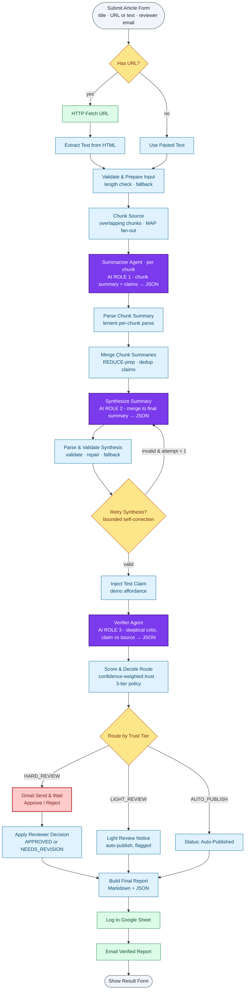

# Veridict

**Fact-checked research summaries with a trust score.** An agentic n8n workflow.

A multi-agent n8n workflow that turns any article/paper - short or long - into a **fact-checked summary with a trust score**. Long sources are split into chunks and summarized **map-reduce** style (a *Summarizer* runs per chunk, a *Synthesizer* merges them with a bounded self-correction retry); an independent *Verifier* agent then checks every claim against the original source. Deterministic logic computes a **confidence-weighted** trust score and routes each result down one of **three tiers** - auto-publish, light-review, or a **human reviewer** gate - before anything is published or logged.

> Built for the *Agentic Workflow Design and n8n Demo* assignment (individual submission).

**Demo video:** _<!-- PASTE YOUR VIDEO URL HERE (Google Drive / Loom, set to "anyone with the link can view") -->_

---

## 1. The problem (1-line)

LLM summaries hallucinate - they add claims that aren't in the source. You can't trust a summary without re-reading the paper. **This workflow makes the summary auditable** and stops untrustworthy output from being published silently.

- **User:** students / researchers / analysts who summarize papers and articles at volume.
- **Pain:** no way to know which sentences in an AI summary are actually backed by the source.
- **Output:** a claim-by-claim verification report + trust score, logged to a sheet and emailed, with a human gate for low-trust cases.

See [`PROBLEM_STATEMENT.md`](./PROBLEM_STATEMENT.md) for the full framing.

---

## 2. Architecture diagram



**Legend:** **AI reasoning** (the 3 purple agent roles) · **deterministic** code · **control/routing** (IF / Switch) · **tool/integration** · **human-in-the-loop**. Only the three purple nodes use AI - everything else, including the loop and all routing, is rule-based.

> Rendered images (for slides / video thumbnail): [`docs/architecture.png`](./docs/architecture.png) (tall) and [`docs/architecture-wide.png`](./docs/architecture-wide.png) (banner). Source: [`docs/architecture.mmd`](./docs/architecture.mmd).

<details>
<summary>Text-only fallback (if Mermaid doesn't render)</summary>

```
Form (Title + URL or pasted text + reviewer email)
 → IF Has URL? ── true → HTTP Fetch → Extract Text (HTML→plain)
 └ false → Use Pasted Text
 → Validate & Prepare Input            [deterministic + fallback if too short]
 → Chunk Source                        [deterministic: overlapping chunks - MAP fan-out]
 → Summarizer Agent (per chunk)        [AI ROLE 1: chunk summary + claims → JSON]
 → Parse Chunk Summary                 [deterministic, lenient]
 → Merge Chunk Summaries               [deterministic REDUCE-prep: dedup claims]
 → Synthesize Summary                  [AI ROLE 2: merge to final summary + claims → JSON]
 → Parse & Validate Synthesis          [deterministic validation + fallback]
 → IF Retry Synthesis?  ── invalid (attempt<1) → loop back to Synthesize   ← SELF-CORRECTION
 →                          valid → Inject Test Claim (demo affordance)
 → Verifier Agent (Claude/Gemini)      [AI ROLE 3: skeptical critic, claim vs source → JSON]
 → Score & Decide Route                [deterministic: confidence-weighted trust, 3-tier policy]
 → Switch Route by Trust Tier
        HARD_REVIEW  → Gmail Send-&-Wait (Approve/Reject) → Apply Reviewer Decision  ← HUMAN-IN-THE-LOOP
        LIGHT_REVIEW → Light Review Notice (auto-publish, flagged)
        AUTO_PUBLISH → Status: Auto-Published
 → Build Final Report (Markdown + JSON)
 → Log to Google Sheet → Email Report → Show Result form
```
</details>

---

## 3. Node-by-node - and *why each exists*

28 nodes total. The three **AI roles** are bolded; everything else is deterministic plumbing.

| # | Node | Type | Role |
|---|------|------|------|
| 1 | **Submit Article** | Form Trigger | Structured input: title, URL or pasted text, reviewer email, and an optional *Inject Test Claim* field (demo affordance to force the review branch) |
| 2 | **Has URL?** | IF (deterministic) | Branch: fetch a URL vs use pasted text |
| 3 | **Fetch URL Content** | HTTP Request (tool use) | Pulls the page; `neverError` so a bad URL doesn't crash the run (fallback) |
| 4 | **Extract Text from HTML** | Code (deterministic) | Strips tags → clean plain text |
| 5 | **Use Pasted Text** | Set (deterministic) | Normalizes the no-URL branch to the same shape |
| 6 | **Validate & Prepare Input** | Code (deterministic) | Length check + safety cap; **throws a fallback error if input is too short** |
| 7 | **Chunk Source** | Code (deterministic) | Splits the source into overlapping chunks → one item per chunk (the **map** fan-out) |
| 8 | **Summarizer Agent** *(per chunk)* | LLM Chain + AI | **AI ROLE 1** - summarizes one chunk + extracts its claims, JSON only. Runs once per chunk. |
| 9 | **Parse Chunk Summary** | Code (deterministic) | Lenient per-chunk parse; a bad chunk yields no claims instead of failing the run |
| 10 | **Merge Chunk Summaries** | Code (deterministic) | The **reduce** prep: gathers all chunks, dedups claims, concatenates partial summaries |
| 11 | **Synthesize Summary** | LLM Chain + AI | **AI ROLE 2** - merges the partial summaries + candidate claims into one final summary + canonical claim set |
| 12 | **Parse & Validate Synthesis** | Code (deterministic) | Parses/repairs JSON; emits a bounded `needs_retry` signal via `$runIndex` |
| 13 | **Retry Synthesis?** | IF (deterministic) | **Self-correction loop** - on invalid JSON (attempt < 1) loops back to *Synthesize Summary* with a stricter prompt; else proceeds. Falls back to deterministic claims if still bad. |
| 14 | **Inject Test Claim** | Code (deterministic) | Optional demo affordance: appends a not-in-source claim so the Verifier has a guaranteed hallucination to catch |
| 15 | **Verifier Agent** | LLM Chain + AI | **AI ROLE 3** - independent critic; SUPPORTED / PARTIAL / UNSUPPORTED + evidence + confidence per claim |
| 16 | **Score & Decide Route** | Code (deterministic) | Computes `trust_score` and a **confidence-weighted** score; picks one of three routes vs policy thresholds |
| 17 | **Route by Trust Tier** | Switch (deterministic) | 3-way: `HARD_REVIEW` / `LIGHT_REVIEW` / `AUTO_PUBLISH` |
| 18 | **Human Review (Approve/Reject)** | Gmail *Send & Wait* | **HUMAN-IN-THE-LOOP** - pauses until a person approves/rejects (HARD_REVIEW only) |
| 19 | **Apply Reviewer Decision** | Code (deterministic) | Converts the approval into a `status` |
| 20 | **Light Review Notice** | Set (deterministic) | LIGHT_REVIEW: auto-publishes but stamps `AUTO_PUBLISHED_FLAGGED` for the audit log |
| 21 | **Status: Auto-Published** | Set (deterministic) | High-trust path - no human needed |
| 22 | **Build Final Report** | Code (deterministic) | Markdown report + verification table + stats |
| 23 | **Log to Google Sheet** | Google Sheets (tool use) | Audit log of every run |
| 24 | **Email Verified Report** | Gmail (tool use) | Delivers the report |
| 25 | **Show Result** | Form completion | Shows the report back to the submitter |

*(Nodes 26-28 are the three model nodes - `… - Summarizer`, `… - Synthesizer`, `… - Verifier` - attached to the LLM-Chain nodes above via the purple Model port.)*

**AI is used for exactly three things** - summarizing chunks, synthesizing them into one summary, and judging claims (all open-ended language reasoning). **Everything else is deterministic** - fetching, chunking, parsing, the retry loop, scoring, thresholds, routing, logging. That separation is the whole point of the design. Full reasoning in [`WORKFLOW_EXPLANATION.md`](./WORKFLOW_EXPLANATION.md).

---

## 4. Setup

**Requirements:** n8n (Cloud, Desktop, or self-hosted), a **free Groq API key** (no credit card - see §4a), and a Google account for Sheets + Gmail.

1. **Import** [`workflow.json`](./workflow.json) → n8n → *Workflows* → *Import from File*.
2. **Attach the Groq credential** to the three model nodes (see §4a below). The workflow is provider-agnostic - to use Gemini, OpenRouter, or Claude instead, just swap the three model nodes (see §4a, Option 2).
3. **Gmail credential:** attach to `Human Review (Approve/Reject)` and `Email Verified Report`. Set a real reviewer email when you test (or fill the form's *Reviewer Email* field).
4. **Google Sheets:** create a sheet with header row `timestamp | title | status | route | trust_score | weighted_score | supported | partial | unsupported | n_chunks`, then put its ID in `Log to Google Sheet` (replace `YOUR_GOOGLE_SHEET_ID`).
5. **Run:** open `Submit Article` → *Test workflow* → fill the form. Use [`sample_input.json`](./sample_input.json) for a quick test.

> No Gmail/Sheets? The workflow still demonstrates fully - those three nodes have `continueOnFail`, and the **Show Result** form displays the report regardless. You can swap the Gmail HITL for a Slack *Send & Wait* node with no other changes.

---

### 4a. Running with a FREE API key (no paid account needed)

You don't need a paid key. Any of these free options runs the whole workflow:

#### Option 1 - Groq *(recommended; no credit card; this is what `workflow.json` is pre-wired for)*

1. Go to **[console.groq.com/keys](https://console.groq.com/keys)** → sign in with Google → *Create API Key* (free, no card).
2. In n8n: **Credentials → New → "Groq API"** → paste the key.
3. Import `workflow.json`, open the three model nodes - **`Groq - Summarizer`**, **`Groq - Synthesizer`**, **`Groq - Verifier`** - and select that credential on each. Model `llama-3.3-70b-versatile` is already set.
4. That's it - run it.

> Groq's free tier is generous and needs no card. The map-reduce step makes one call per chunk plus a synthesis call, so a long document uses more calls - if you hit a per-minute rate limit mid-run, wait ~30s and re-run, or switch the model to `llama-3.1-8b-instant`.

#### Option 2 - Use a different provider (OpenRouter, Gemini, Claude, etc.)

The workflow is provider-agnostic. To switch, **delete** the three Groq model nodes and add three nodes of your provider, then reconnect each to its LLM-Chain node via the purple *Model* port (the dot under `Summarizer Agent`, `Synthesize Summary`, and `Verifier Agent`). Use temperature `0.2` for Summarizer/Synthesizer and `0` for the Verifier.

- **OpenRouter** (`OpenRouter Chat Model`, key from [openrouter.ai](https://openrouter.ai)) - pick a free model such as `meta-llama/llama-3.3-70b-instruct:free`.
- **Google Gemini** (`Google Gemini Chat Model`, key from [aistudio.google.com/app/apikey](https://aistudio.google.com/app/apikey)) - note Gemini's free tier is **region-restricted**; some accounts return `quota limit 0` and must enable billing first.
- **Anthropic Claude** (`Anthropic Chat Model`) - `claude-sonnet-4-6`.

> The prompts are model-agnostic - they already demand strict JSON, and the deterministic parse nodes (`Parse Chunk Summary`, `Parse & Validate Synthesis`, `Score & Decide Route`) repair and validate the output, so smaller free models still work. If a model returns prose around the JSON, those nodes strip it; if the synthesis is unusable it self-corrects once then falls back to deterministic claims; if the verifier output is unusable the run safely routes to human review (by design).

---

## 5. Sample input / output

- Input: [`sample_input.json`](./sample_input.json)
- Output: [`sample_output.md`](./sample_output.md) - shows both a high-trust auto-publish run and a low-trust run that hits human review.

---

## 6. Agentic practices checklist (assignment §6)

- **Agent roles** - Summarizer (per-chunk generator), Synthesizer (reducer), Verifier (critic) - three deliberately separated roles.
- **Map-reduce** - long sources are chunked, summarized in parallel, then reduced into one summary.
- **Structured I/O** - strict JSON schemas in/out of every agent.
- **Self-correction** - a bounded retry loop re-prompts the Synthesizer once on malformed JSON before falling back.
- **Tool use** - HTTP fetch, Google Sheets, Gmail.
- **Branching/routing** - URL vs text; a 3-way trust-tier Switch; approve vs revise.
- **Deterministic checks** - length validation, JSON validation, confidence-weighted trust score, policy thresholds.
- **Human-in-the-loop** - Gmail Send & Wait approval gate on the HARD_REVIEW tier.
- **Fallback handling** - bad URL, short input, malformed chunk/synthesis JSON, and unusable verifier output all degrade safely.

## 7. Limitations & next steps

- Chunks are summarized independently, so a claim that spans a chunk boundary may be split (the overlap mitigates but doesn't eliminate this).
- Trust score weights by the verifier's self-reported confidence - a calibrated/external confidence model would be stronger.
- The Verifier sees the same source as the Summarizer; a retrieval step over external sources would also catch errors in the source itself.

## Repo contents

```
workflow.json importable n8n workflow (free Groq; swap the model nodes for any provider)
README.md this file
PROBLEM_STATEMENT.md user / pain / goal / output
WORKFLOW_EXPLANATION.md AI vs deterministic deep-dive
sample_input.json test input
sample_output.md example runs (auto-publish + review), live-verified
docs/ architecture diagrams (+ screenshots)
```
